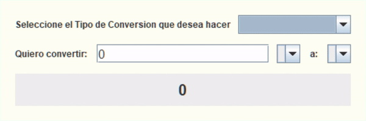

### Demo

### Funcionalidades (Reto)

#### Requerimientos de Base:

La aplicación debe cumplir con los siguientes requerimientos:

- Convertir de Dólar a la moneda de tu país:
- Convertir de la moneda de tu país a Dólar.
- Convertir de la moneda de tu país a Euros.
- Convertir de la moneda de tu país a Libras Esterlinas.
- Convertir de la moneda de tu país a Yen Japonés.
- Convertir de la moneda de tu país a Won sul-coreano.

- Convertir de Dólar a la moneda de tu país
- Convertir de Euros a la moneda de tu país
- Convertir de Libras Esterlinas a la moneda de tu país
- Convertir de Yen Japonés a la moneda de tu país
- Convertir de Won sul-coreano a la moneda de tu país

#### Requerimientos Extras:

- Después de que el usuario haga clic en continuar en el programa, presente el cuadro de opciones de conversión para que pueda verificar otro valor en una moneda diferente.
- Realiza más de un programa de conversión, además de moneda, puede hacer de temperatura, kilometraje, años luz, entre otros, deja volar tu imaginación.

### Funcionalidades (Resultado)

Cumple con los objetivos propuestos, y a mi consideracion, de una manera mas eficiente, logra adaptarse a mas posibles conversiones
-Cuenta con una conversion de Temperatura y Distancia
-Una interfaz intuitiva, que se adapta a las opciones del usuario
-Hace uso de Combo boxes, para permitir seleccionar de manera mas eficaz las opciones de cambio
